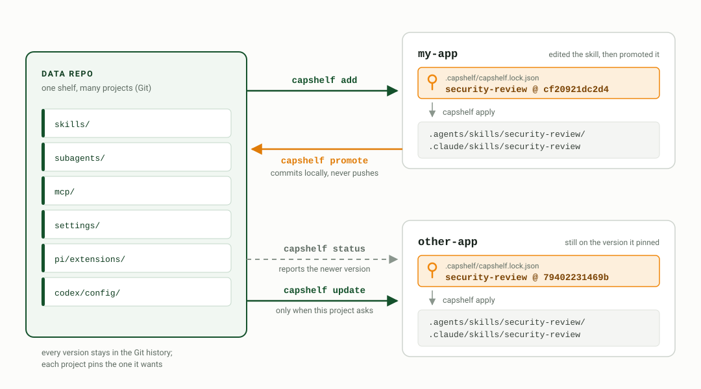
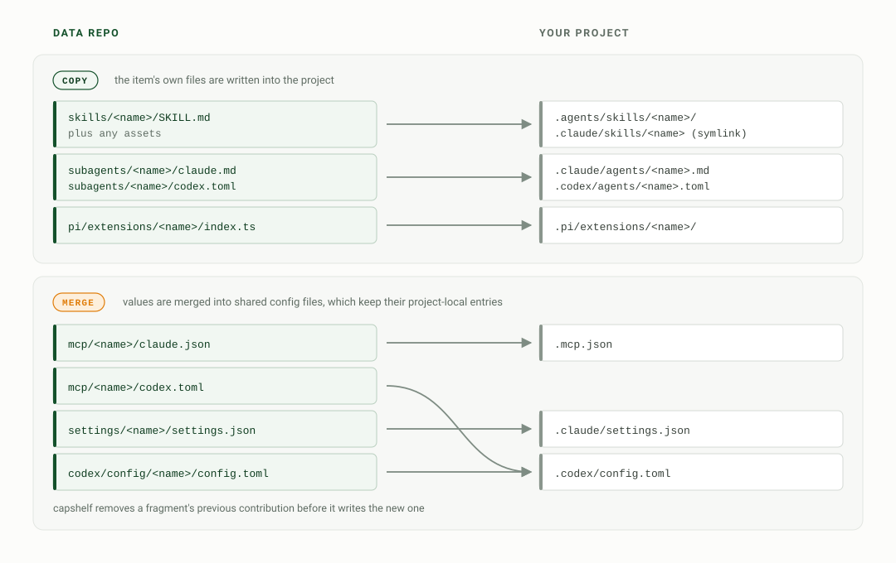

<p align="center">
  
</p>
<h1 align="center">Capshelf</h1>
<h3 align="center">Shared coding-agent config, pinned per project — a change in one repo never disturbs another until that repo asks for it</h3>
<p align="center">
<a href="https://github.com/genged/capshelf/actions/workflows/release.yml">
  
</a>
<a href="https://github.com/genged/capshelf/releases/latest">

</a>

</p>

A Git-backed CLI for sharing coding-agent configuration — skills, Pi
extensions, subagents, settings, and MCP fragments — across projects, with a
lockfile per project.

As you accumulate projects, you accumulate copies of the same skills, the same
settings overlays, the same MCP servers. Copy them by hand and every project
drifts out of date. Symlink the whole directory and an edit for one project
silently changes all of them, with no diff and no way to keep a local variant.

<p align="center">
  <picture>
    <source media="(prefers-color-scheme: dark)" srcset="docs/diagram-flow-dark.svg">
    
  </picture>
</p>

Two projects, `my-app` and `other-app`, both using a shared `security-review`
skill. `other-app` installs it from the data repo:

```console
$ cd ~/code/other-app
$ capshelf add security-review
✓ added project/data/skills/security-review @ 79402231469b
  source commit: 0d70263c55801ad4bb06206d9f91f7fbd520ca9a
  /home/agent/code/other-app/.agents/skills/security-review
```

`my-app` edits its copy. `status` names the kind of drift and shows it:

```console
$ cd ~/code/my-app
$ echo '- parameterized queries assumed; flag every f-string in a query' >> "$(capshelf get-path security-review)/SKILL.md"
$ capshelf status security-review --diff
/home/agent/code/my-app  (1 item)

project/
  ✎   data/skills/security-review             79402231469b  drifted (1 file: content-edit)

diff data/skills/security-review
--- SKILL.md (locked data/skills/security-review)
+++ SKILL.md (current)
@@ -8,3 +8,4 @@ Check every changed handler for:
 - SQL built by string concatenation
 - endpoints with no authorization check
 - secrets read from source instead of the environment
+- parameterized queries assumed; flag every f-string in a query
```

`promote` commits that edit to the data repo. It never pushes:

```console
$ capshelf promote security-review -m "tighten SQLi check"
✓ promoted data/skills/security-review @ cf20921dc2d493caa2dc9eab4c73cce4608e17dd8e494faaa2db3b49f0529f5b
  source commit: 50bebc39ea903ce11ce61958bfed4650f758a99a

committed to local data repo:
  ~/code/agent-config

to share upstream:
  cd ~/code/agent-config
  git push
```

`other-app` is untouched. It still holds the version it pinned, and is told a
newer one exists:

```console
$ cd ~/code/other-app
$ capshelf status security-review
/home/agent/code/other-app  (1 item)

project/
  ⚠   data/skills/security-review             79402231469b  update available → cf20921dc2d493caa2dc9eab4c73cce4608e17dd8e494faaa2db3b49f0529f5b
```

Its files change only when someone runs `capshelf update` there.

## Quickstart

### 1. Install Capshelf

```bash
brew install genged/tap/capshelf
```

Capshelf also needs `git` 2.40 or newer on your `PATH`.

Without Homebrew, use the install script. It downloads the latest GitHub
release for your platform, verifies its SHA-256 checksum, and installs to
`~/.local/bin/capshelf`:

```bash
curl -fsSL https://raw.githubusercontent.com/genged/capshelf/main/scripts/install.sh | sh
```

To build from this repo instead:

```bash
bun install
make install     # builds dist/capshelf and copies it to ~/.local/bin/capshelf
```

Make sure `~/.local/bin` is on your `PATH` when using the source install.

Homebrew installs can check or apply binary updates with:

```bash
capshelf self-update --check
capshelf self-update
```

Source installs update manually with `git pull && make install`.

### 2. Create the data repo

The data repo is a second Git repo, separate from every project that uses it.
Create it once. Every project you connect later reads from it.

```bash
mkdir -p ~/code/agent-config
cd ~/code/agent-config
git init
git remote add origin https://github.com/acme/agent-config
git commit --allow-empty -m "initialize shared agent config"
```

It starts empty. Step 3 fills it.

`init` reads that `origin` and records it as `dataRepoUpstream`, so future
clones discover the same source. Point it at a repo you can push to. For a
machine-local sandbox with no remote, add `--no-upstream` to the `init` command
in the next step.

### 3. Connect a project

Bind the project, then look at what is on the shelf:

```bash
cd ~/code/my-app
capshelf init --data ~/code/agent-config
capshelf ls
```

The shelf is empty, so fill it. Move a skill this project already has into the
data repo; capshelf commits it there and tracks it here:

```bash
capshelf share skills/security-review --to project \
  -m "share existing security-review skill"
capshelf status
```

That works for any skill under `.agents/skills/<name>/` or
`.claude/skills/<name>/`. Repeat it from each repository holding skills you want
to centralize.

No skills anywhere yet? Create one, so the loop has something to carry:

```bash
mkdir -p .agents/skills/hello
cat > .agents/skills/hello/SKILL.md <<'EOF'
---
name: hello
description: Smoke test. Confirms capshelf is installed and a data repo is bound.
---

Reply with "capshelf is working".
EOF
capshelf share skills/hello --to project -m "add hello skill"
capshelf status
```

Either path ends the same way. `status` lists the shared skill next to the
system skill that `init` installed:

```console
$ capshelf status
/home/agent/code/my-app  (2 items)

project/
  ✓   system/skills/capshelf                  aeb97bf2b397  up-to-date
  ✓   data/skills/security-review             79402231469b  up-to-date
```

By default, skills are installed under `.agents/skills/<name>/` and exposed to
Claude through `.claude/skills/<name>` symlinks. Use `capshelf init
--claude-only --data <repo>` if a project should write real skill directories
directly under `.claude/skills/`.

### Two repos, side by side

After step 3 you have both. A data repo holds items at the top level; a project
holds `.capshelf/` pins and the installed copies:

```text
~/code/agent-config/                 the data repo
  skills/security-review/SKILL.md
  mcp/github/claude.json

~/code/my-app/                       a project that uses it
  .capshelf/                         manifest and lock
  .agents/skills/security-review/    installed copy
```

Capshelf accepts a project's own path as `--data` and reports success. That
makes the project its own shelf, private to itself. Keep the two separate.

One data repo serves many projects. You can keep more than one — a work shelf
and a personal shelf, say — and bind each project to the one it needs.

### Joining a data repo that already has items

If your team already runs one, skip step 2 and bind to your clone of it:

```bash
cd ~/code/my-app
capshelf init --data ~/code/agent-shared
capshelf ls
capshelf add security-review
capshelf status
```

Use `add` for an item the data repo already holds, and `share` to move one up
there for the first time.

## Examples

Add a shared skill:

```bash
capshelf ls
capshelf show security-review --no-content
capshelf add security-review
```

Update a project when the data repo changes:

```bash
capshelf status
capshelf update --dry-run
capshelf update
```

Edit a skill locally, then choose what to do with the drift:

```bash
$EDITOR "$(capshelf get-path security-review)/SKILL.md"
capshelf status security-review --diff

capshelf promote security-review -m "tighten security review checklist"
# or:
capshelf keep-local security-review --reason "project-specific review rules"
# or, discarding the edit:
capshelf revert security-review --yes         # or answer y at the prompt
```

Adopt a project-local skill into the shared data repo:

```bash
mkdir -p .agents/skills/write-migration
$EDITOR .agents/skills/write-migration/SKILL.md
capshelf share skills/write-migration --to project -m "add write-migration skill"
```

Share fragment values that already live in this project's generated outputs —
no separate source file needed; the output file stays as it is, and the picked
values become managed:

```bash
capshelf share mcp/github                                    # adopt the unmanaged `github` server from .mcp.json / .codex/config.toml
capshelf share settings/permissions --pick permissions.allow # extract a settings value by path
```

Add a project-local Pi extension from `pi/extensions/<name>/index.ts` in the
data repo (review it first; extensions execute arbitrary code after Pi project
trust):

```bash
capshelf show pi-extensions/path-guard
capshelf add pi-extensions/path-guard
# or keep the selection clone-local:
capshelf add pi-extensions/path-guard --local
# then run /reload in Pi or restart Pi
```

Add shared config fragments:

```bash
capshelf add settings/security-base
capshelf add mcp/github
capshelf add codex-config/defaults
capshelf get-path mcp/github --target codex
capshelf get-path mcp/github --target codex --output
```

Add one logical subagent for every runtime definition it provides:

```bash
capshelf add subagents/reviewer
capshelf get-path subagents/reviewer --target claude --output
capshelf get-path subagents/reviewer --target codex
```

Set up a whole service from a curated bundle (`bundles/<name>.yml` in the
data repo) — members install as independent items, all-or-nothing:

```bash
capshelf search "go backend"
capshelf show bundles/go-backend     # preview members + install state
capshelf add bundles/go-backend
```

Curate the same canonical skills into independent Claude/Cowork and Codex
plugins without installing either runtime:

```bash
capshelf --data ~/code/agent-config marketplace init \
  --target codex --name company-workflows --owner Engineering
capshelf --data ~/code/agent-config marketplace plugin create engineering \
  --target codex --skill skills/security-review
capshelf --data ~/code/agent-config marketplace validate --target codex
```

The data repo is then a native local Codex marketplace. Claude entries use
the official `.claude-plugin/marketplace.json`; `plugin pack --target claude`
builds a standalone `.plugin` file for Cowork upload. Capshelf creates and
commits catalog state; the runtimes handle the plugin lifecycle. Identities are
kebab-case, and plugin creation requires a skill. `validate` reports projection
drift, where a generated Codex catalog no longer matches its source
definitions, and checks Claude packages against Cowork's known file and byte
limits. [`docs/marketplaces.md`](docs/marketplaces.md) covers the full report.

Bootstrap a new project straight from a shared data repo URL (capshelf clones
it once under `~/.local/share/capshelf/data/...`, or to `--data-dir <path>`,
and binds the local clone):

```bash
cd ~/code/my-app
capshelf init --data https://github.com/acme/agent-config
capshelf add security-review
```

Connect a freshly cloned project to its data repo:

```bash
cd ~/code/my-app
capshelf init
capshelf apply
```

That works when the project committed `.capshelf/capshelf.json` with a
`dataRepoUpstream`. If you already cloned the data repo somewhere custom, use
`capshelf data bind <path-to-data-repo>` instead of `capshelf init`.

## What Capshelf manages

<p align="center">
  <picture>
    <source media="(prefers-color-scheme: dark)" srcset="docs/diagram-kinds-dark.svg">
    
  </picture>
</p>

| Kind | Data repo path                       | Project output |
|---|--------------------------------------|---|
| `skills` | `skills/<name>/SKILL.md` plus assets | `.agents/skills/<name>/` and `.claude/skills/<name>` symlink |
| `pi-extensions` | `pi/extensions/<name>/index.ts` plus local modules | `.pi/extensions/<name>/` |
| `subagents` | `subagents/<name>/claude.md`, `subagents/<name>/codex.toml` | `.claude/agents/<name>.md` and/or `.codex/agents/<name>.toml` |
| `settings` | `settings/<name>/settings.json`      | merged into `.claude/settings.json` |
| `mcp` | `mcp/<name>/claude.json`, `mcp/<name>/codex.toml` | merged into `.mcp.json` and/or `.codex/config.toml` |
| `codex-config` | `codex/config/<name>/config.toml` | merged into `.codex/config.toml` |

Pi extensions can use committed project scope or clone-local Capshelf scope;
both materialize to Pi's project-local `.pi/extensions/<name>/` path and execute
arbitrary code after Pi project trust. Capshelf reports that warning.

Codex only loads project `.codex/config.toml` in trusted projects. Capshelf
writes the project file and reports a non-failing status warning when Codex
appears likely to ignore it.

Each project gets a `.capshelf/` directory:

```text
.capshelf/
  capshelf.json        committed manifest: install mode, upstream, declared items
  capshelf.lock.json   committed lock: committed-tree digest and source commit
  local.json           gitignored: data repo path plus clone-local copy-item intent
  local.lock.json      gitignored: clone-local item pins
  .gitignore           written by capshelf: the rule that ignores those two files
```

The lockfile is the safety boundary. A data item's identity is the committed
Git tree: a SHA-256 digest over the sorted `(name, mode, blobId)` entries the
data repo holds at the pinned commit. Computing it reads no file content, so
working-tree state, Git configuration, and checkout filters cannot change what
a pin means. System items bundled inside the CLI are pinned by content hash
plus CLI version.

### What Capshelf leaves alone

Capshelf writes the files it owns and reports on the rest. These stay with you
or with the runtime:

- Pi extension sandboxing, `package.json` dependencies, `.pi/settings.json`,
  and reloading Pi.
- Registering, installing, refreshing, and removing runtime plugins. Capshelf
  creates and commits the catalog state those runtimes read.
- Skills managed by `skills.sh`, Claude marketplace plugins, and personal
  `~/.claude/skills/` entries. Capshelf reports them as external state.

## Mental model

Capshelf is a declarative reconciler, not a package installer:

- `capshelf.lock.json` is the spec.
- `capshelf apply` reconciles project files to that spec.
- `capshelf status` shows the plan before anything changes.
- `capshelf update` advances selected pins to current data-repo content.
- `capshelf promote` pushes local edits back into the data repo and updates only
  the current project's lock.

That last bullet is why the transcript above works: project B keeps its pin
until someone runs `capshelf update` there.

## Command reference

| Verb | Purpose |
|---|---|
| `init` | scaffold `.capshelf/`, install bundled system items, bind a data repo |
| `data bind` | bind this machine's clone of the data repo |
| `data upstream` | write the committed upstream URL |
| `data path` | print the resolved local data repo path |
| `data sync` | fetch the data repo's `origin` and fast-forward when safe; the only network command besides the `init` bootstrap clone and `self-update` |
| `ls` / `show` | inspect data repo items, installed items, and bundles; `ls` also shows user-level runtime skills by default |
| `search` | find items and bundles by name, tags, description, or content |
| `add` / `rm` | add or remove an item in this project; `add bundles/<name>` expands a bundle |
| `status` | report drift, missing files, update availability, and user-level runtime skill inventory |
| `apply` | reconcile project files to the current locks |
| `update` | bump pins to data repo HEAD, then apply |
| `share` | adopt an on-disk item into the data repo; fragments can extract unmanaged values straight from generated outputs (`--pick`) |
| `move` | move an item between local and project scope |
| `promote` | commit local edits or fragment source edits for a tracked item back to the data repo |
| `keep-local` | mark drift as intentional |
| `revert` | restore one item to its locked version |
| `get-path` | print the editable path; subagents and multi-target fragments use `--target`, and `--output` returns runtime outputs |
| `lock migrate` | convert the project and local locks to version 4 in one transaction — the one-way upgrade every project on lock version 2 or 3 must run once |
| `self-update` | check for and install a Homebrew update for the capshelf binary |
| `marketplace ...` | author, validate, sync, and package Claude/Cowork or Codex plugin catalogs in the data repo |

The four `data` subcommands keep their older flat names as aliases: `set-data`,
`set-upstream`, `data-path`, and `sync-data`.

Commands support `--json` where useful for agent consumption. Exit codes are
stable: `0` success, `1` generic error, `2` not found, `3` conflict or refused
precondition, `4` drift or upstream mismatch, `5` reserved for future
unmet-requires checks, `6` no data repo configured, `7` `git` missing or older
than 2.40. Full reference: [`docs/cli.md`](docs/cli.md).

Startup self-update prompts are best-effort, cached, and only shown for
interactive Homebrew installs. Set `CAPSHELF_NO_SELF_UPDATE=1` to disable them.

## Development

```bash
bun install
bun run src/cli.ts <verb> [args]   # run from source
bun run test                       # unit tests (4 workers)
make smoke                         # smoke suites (4 workers)
make check                         # typecheck, lint, docs freeze, tests, smoke
make build                         # compile dist/capshelf
```

### CLI source repo

The capshelf source repository contains:

```
<capshelf-source>/
├── src/
│   ├── bundled/                    bundled system items compiled into the binary
│   │   └── skills/capshelf/SKILL.md
│   ├── cli.ts
│   ├── git.ts                      git wrapper module
│   └── …
├── dist/                           built binary (gitignored)
├── package.json
├── Makefile
├── docs/                           living docs
└── .git/
```

**Code only** — no `skills/`, `settings/`, `mcp/`, etc. at the top level. Data lives in a separate directory.

### Smoke-test data repo

The source repo's smoke tests need *some* data repo to point at. A common local
fixture is `~/code/capshelf-data/`:

```
~/code/capshelf-data/
├── skills/
│   └── hello/SKILL.md            smoke-test dummy
└── .git/
```

There is no implicit default. The `Makefile`'s smoke targets each create their own temporary data repo so regression tests do not depend on this fixture. For day-to-day dev, set `CAPSHELF_HOME=~/code/capshelf-data` in your shell so `init` doesn't need `--data` every time.

A real user creates their own data repos (`~/code/work-skills/`, `~/code/personal-skills/`, etc.) — `capshelf-data` is just the test fixture for this codebase.

## Project status

| Capability | State | Reference |
|---|---|---|
| Skills, project-local Pi extensions, Claude/Codex subagents | shipped | [item kinds](docs/cli.md#item-kinds) |
| Settings, MCP, and project-scoped Codex config fragments | shipped | [config fragments](docs/cli.md#config-fragments) |
| Bundles — curated item sets, expanded all-or-nothing | shipped | [bundles](docs/cli.md#bundles) |
| Item metadata driving `ls --tag`, `search`, and `requires`/`conflicts-with` | shipped | [item metadata](docs/cli.md#item-metadata) |
| Claude/Cowork and Codex plugin catalogs in the data repo | shipped | [plugin marketplaces](docs/cli.md#plugin-marketplaces) |
| `validate`, `diff`, `doctor`, `journal` | roadmap | — |

Fragment behavior to know before you adopt them:

- Fragment outputs preserve project-local values.
- `promote` commits the fragment's canonical source file in the data repo. The
  generated output is a product of that source.
- `share --pick` extracts an unmanaged value straight from a project's
  generated output.

Bundles expand at install time. Members become independent items, and the lock
records each member on its own.

## Further reading

- [`docs/project-brief.md`](docs/project-brief.md) - one-page overview
- [`docs/cli.md`](docs/cli.md) - full command reference, flags, exit codes
- [`docs/architecture.md`](docs/architecture.md) - data model and rationale
- [`docs/team-workflow.md`](docs/team-workflow.md) - team loop: `data sync`, propose-upstream recipe, CI drift gate
- [`docs/security.md`](docs/security.md) - trust model, threat model per item kind, guidance for teams
- [`docs/marketplaces.md`](docs/marketplaces.md) - Claude/Cowork and Codex plugin catalogs in the data repo
- [`AGENTS.md`](AGENTS.md) - guidance for coding agents working in this repo

### Release history

- [`docs/whats-new-0.9.md`](docs/whats-new-0.9.md) - runtime target coverage for mcp and subagents, pin-sourced fragment installs, gated Codex trust warning
- [`docs/whats-new-0.8.md`](docs/whats-new-0.8.md) - Git-tree source pins, lock version 4 and `lock migrate`, filtered-content refusal, classified drift
- [`docs/whats-new-0.7.md`](docs/whats-new-0.7.md) - destructive-change consent, preserved local files, keep-local intent, init recovery
- [`docs/whats-new-0.6.md`](docs/whats-new-0.6.md) - subagents, plugin marketplaces, declared needs, stale-promote merges
- [`docs/whats-new-0.5.1.md`](docs/whats-new-0.5.1.md) - clone-local reconciliation and recovery fixes
- [`docs/whats-new-0.5.md`](docs/whats-new-0.5.md) - Pi extensions, user skill inventory, safer CLI behavior
- [`docs/whats-new-0.4.md`](docs/whats-new-0.4.md) - remote bootstrap, metadata + search, team sync, bundles
